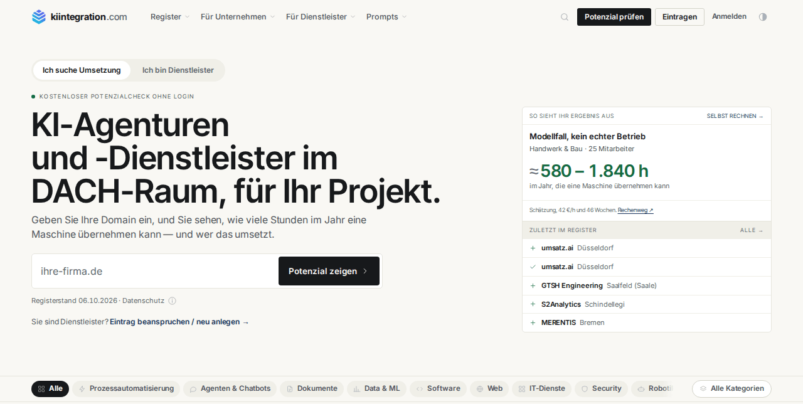

<p align="center">
  <a href="https://kiintegration.com/mcp/?utm_source=github&utm_medium=referral&utm_campaign=mcp">
    
  </a>
</p>

<h1 align="center">KI Integration Register: MCP-Server</h1>

<p align="center">
  KI-Agenturen, KI-Beratungen und Dienstleister für Automatisierung in Deutschland, Österreich und der Schweiz finden, direkt aus Claude, ChatGPT, Cursor oder VS Code.<br>
  Dazu Förderprogramme für Digitalisierung und KI je Bundesland. Gehostet, ohne Anmeldung, nur lesend.
</p>

<p align="center">
  <a href="LICENSE"></a>
  <a href="https://modelcontextprotocol.io"></a>
  <a href="#werkzeuge"></a>
  
  
  <a href="https://github.com/kiintegration-com/mcp/actions/workflows/test.yml"></a>
</p>

---

Wer für ein KI-Vorhaben einen Umsetzer sucht, fragt heute einen Assistenten und bekommt Namen, die er nicht prüfen kann. Mit diesem Server fragt der Assistent das [KI Integration Register](https://kiintegration.com/?utm_source=github&utm_medium=referral&utm_campaign=mcp): erfasste Betriebe mit Typ, Ort, Leistungsfeldern und Prüfstatus, jeweils mit Profiladresse und Quelle. Der Server läuft bei kiintegration.com; Sie tragen nur eine Adresse ein.

```text
https://kiintegration.com/api/mcp
```

## Inhalt

- [Einrichten](#einrichten)
- [Werkzeuge](#werkzeuge)
- [Beispiel](#beispiel)
- [Grenzen und Datenschutz](#grenzen-und-datenschutz)
- [Lokal über stdio](#lokal-über-stdio)
- [Über kiintegration.com](#über-kiintegrationcom)
- [Lizenz](#lizenz)

## Einrichten

### Claude Code

```bash
claude mcp add --transport http kiintegration https://kiintegration.com/api/mcp
```

### Claude.ai und Claude Desktop

Einstellungen → Konnektoren → **Eigenen Konnektor hinzufügen**, Name `KI Integration Register`, URL `https://kiintegration.com/api/mcp`. Keine Anmeldung, kein Schlüssel.

Ältere Fassungen von Claude Desktop sprechen nur stdio. Dann in `claude_desktop_config.json`:

```json
{
  "mcpServers": {
    "kiintegration": {
      "command": "npx",
      "args": ["-y", "mcp-remote", "https://kiintegration.com/api/mcp"]
    }
  }
}
```

### Cursor

`~/.cursor/mcp.json` (für alle Projekte) oder `.cursor/mcp.json` (für eines):

```json
{
  "mcpServers": {
    "kiintegration": { "url": "https://kiintegration.com/api/mcp" }
  }
}
```

### VS Code (GitHub Copilot)

```bash
code --add-mcp '{"name":"kiintegration","type":"http","url":"https://kiintegration.com/api/mcp"}'
```

Oder `.vscode/mcp.json` im Projekt:

```json
{
  "servers": {
    "kiintegration": { "type": "http", "url": "https://kiintegration.com/api/mcp" }
  }
}
```

### Windsurf

`~/.codeium/windsurf/mcp_config.json`:

```json
{
  "mcpServers": {
    "kiintegration": { "serverUrl": "https://kiintegration.com/api/mcp" }
  }
}
```

### Andere Clients

Jeder Client mit Streamable HTTP nimmt die Adresse oben. Für Clients, die nur stdio kennen, liegt in diesem Repo eine Brücke: [Lokal über stdio](#lokal-über-stdio).

## Werkzeuge

| Werkzeug | Wofür | Eingaben |
|---|---|---|
| `dienstleister_suchen` | Betriebe nach Leistungsfeld, Land, Region, Ort oder Stichwort finden. Name, Typ, Ort, Leistungsfelder, Prüfstatus, Website und Profiladresse, höchstens 25 Treffer, verifizierte zuerst. | `suche`, `leistungsfeld`, `land` (DE, AT, CH), `region`, `ort`, `nur_verifiziert`, `anzahl` |
| `profil_abrufen` | Das Profil eines Betriebs als Markdown: Leistungsfelder, Nachweiswert mit seinen Haken, Quellen, Stand. | `slug` oder Profiladresse |
| `leistungsfelder_auflisten` | Die Leistungsfelder mit Zahl der Betriebe und Unterfeldern; die Slugs passen in die Suche. | keine |
| `foerderprogramme_suchen` | Förderprogramme für Digitalisierung und KI: Bund und EU je Land, mit Region dazu das Bundesland bzw. der Kanton. Quote, Höchstbetrag, Frist, Prüfdatum, amtliche Quelle. | `land`, `region`, `zweck`, `auch_beendete` |

Alle vier lesen nur (`readOnlyHint`). Antworten und Beschreibungen sind auf Deutsch, wie das Register.

## Beispiel

> **Frage an den Assistenten:** Wir wollen Eingangsrechnungen automatisch erfassen lassen. Wer macht so etwas in der Nähe von Nürnberg, und gibt es in Bayern Förderung dafür?

Der Assistent ruft `leistungsfelder_auflisten`, dann `dienstleister_suchen` mit `leistungsfeld: "dokumentenverarbeitung"` und `region: "bayern"`, liest zwei Profile mit `profil_abrufen` und fragt `foerderprogramme_suchen` mit `region: "bayern"`. Jede Antwort trägt den Stand der Daten und den Hinweis, welche Einträge ungeprüft sind.

## Grenzen und Datenschutz

- **Nur öffentliche Angaben.** Der Server liefert, was auch auf den Profilseiten steht. Telefonnummern, Mailadressen, Registernummern, Steuernummern und Namen vertretungsberechtigter Personen der Betriebe liefert er nicht.
- **Ungeprüft, außer markiert.** Einträge stammen aus öffentlichen Quellen, vor allem dem Impressum. Verifiziert heißt: Der Betrieb hat seinen Eintrag beansprucht und bestätigt.
- **Keine Rangliste nach Qualität.** Die Reihenfolge ist die der Registerlisten: verifizierte zuerst, die übrigen jeden Tag neu gemischt. Bezahlung verschiebt sie nicht.
- **Einzelabruf.** Höchstens 25 Treffer je Suche, kein Blättern. Je Absenderadresse 60 Nachrichten in der Minute und 120 Werkzeugaufrufe in der Stunde, darüber HTTP 429 mit `Retry-After`. Systematisches Auslesen des Bestands untersagen die [Nutzungsbedingungen](https://kiintegration.com/nutzungsbedingungen/?utm_source=github&utm_medium=referral&utm_campaign=mcp).
- **Was der Server speichert.** Keine Inhalte Ihrer Anfragen. Zur Grenze zählt er je Adresse im Arbeitsspeicher, längstens eine Stunde; Profilabrufe zählt der Abrufwächter des Registers wie Abrufe der Profilseite. Einzelheiten in der [Datenschutzerklärung](https://kiintegration.com/datenschutz/?utm_source=github&utm_medium=referral&utm_campaign=mcp).
- **Keine Anfrage über das Werkzeug.** Eine Anfrage an einen Betrieb stellt der Mensch selbst über die Profilseite, kostenlos.

## Lokal über stdio

`server.mjs` ist eine Brücke ohne Abhängigkeiten (Node 18 oder neuer): Sie reicht jede JSON-RPC-Zeile von stdin an `https://kiintegration.com/api/mcp` weiter und schreibt die Antwort nach stdout. Eigene Logik hat sie nicht; Werkzeuge und Daten kommen vom Server.

```bash
git clone https://github.com/kiintegration-com/mcp.git kiintegration-mcp
node kiintegration-mcp/server.mjs
```

```json
{
  "mcpServers": {
    "kiintegration": {
      "command": "node",
      "args": ["/pfad/zu/kiintegration-mcp/server.mjs"]
    }
  }
}
```

Mit Docker:

```bash
docker build -t kiintegration-mcp .
docker run -i --rm kiintegration-mcp
```

`KIR_MCP_URL` setzt eine andere Zieladresse, etwa eine lokale Vorschau der Website.

Prüfen:

```bash
node --test
```

## Über kiintegration.com

<a href="https://kiintegration.com/?utm_source=github&utm_medium=referral&utm_campaign=mcp"></a>

[kiintegration.com](https://kiintegration.com/?utm_source=github&utm_medium=referral&utm_campaign=mcp) ist das Register für KI-Agenturen und -Dienstleister in Deutschland, Österreich und der Schweiz. Unternehmen finden dort, wer KI-Projekte umsetzt, mit belegten Angaben und offen gelegter Rangfolge, und stellen kostenlos eine Anfrage an passende Betriebe. Dienstleister tragen sich kostenlos ein und bekommen Anfragen mit konkretem Anlass.

Ohne MCP liest ein Agent das Register auch direkt: jede Seite als Markdown unter derselben Adresse mit `.md` oder mit `Accept: text/markdown`, Einstieg über [`/llms.txt`](https://kiintegration.com/llms.txt). Beschreibung aller Wege: [kiintegration.com/mcp](https://kiintegration.com/mcp/?utm_source=github&utm_medium=referral&utm_campaign=mcp).

Fertige Skills für Betriebe (Angebote, Rechnungen, Fristen, DSGVO): [kiintegration-com/skills](https://github.com/kiintegration-com/skills).

## Mitmachen

Fehler gefunden, Werkzeug fehlt, Antwort missverständlich? [Issue anlegen](https://github.com/kiintegration-com/mcp/issues/new) oder Pull Request stellen, siehe [CONTRIBUTING.md](CONTRIBUTING.md). Sicherheitsprobleme bitte nicht öffentlich, sondern nach [SECURITY.md](SECURITY.md).

## Lizenz

- **Code** in diesem Repo: [MIT](LICENSE).
- **Daten**, die der Server liefert, fallen nicht unter die MIT-Lizenz. Sie gehören zum Register und stehen unter seinen [Nutzungsbedingungen](https://kiintegration.com/nutzungsbedingungen/?utm_source=github&utm_medium=referral&utm_campaign=mcp): Einzelabruf mit Quellenangabe „KI Integration Register, kiintegration.com“ erlaubt, systematisches Auslesen und Vervielfältigen wesentlicher Teile nicht (§§ 87a ff. UrhG); der Vorbehalt für Text- und Data-Mining nach § 44b Abs. 3 UrhG ist erklärt.

---

<p align="center">
  <sub>Gepflegt von <a href="https://kiintegration.com/?utm_source=github&utm_medium=referral&utm_campaign=mcp">kiintegration.com</a> · <a href="README.en.md">English</a> · <a href="CHANGELOG.md">Änderungen</a> · <a href="SECURITY.md">Sicherheit</a></sub>
</p>
